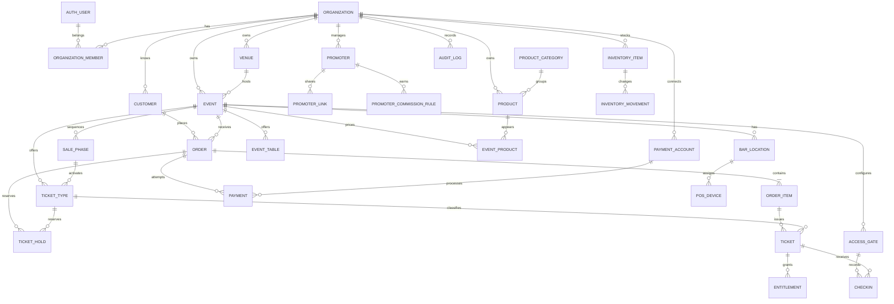
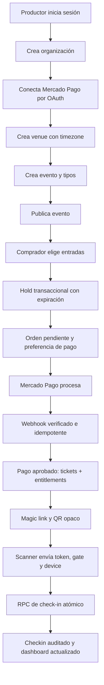

# Nightlife OS — arquitectura y plan de FASE 0–1

Estado: propuesta inicial
Fecha: 2026-08-19
Alcance: foundation, eventos, ticketing y checkout previo al pago real

## 1. Diagnóstico del repositorio

El repositorio está vacío: contiene únicamente `.git`, no tiene commits, archivos de aplicación, configuración, dependencias ni infraestructura. No existe código para reutilizar, deuda técnica ni conflictos de arquitectura. Esto permite iniciar con una estructura deliberada, pero también significa que todavía no hay decisiones operativas implícitas que puedan darse por resueltas.

### Stack propuesto

- Next.js 16.3 con App Router, React, TypeScript estricto y runtime Node.js por defecto.
- Tailwind CSS y componentes accesibles propios basados en primitives; evitar una capa visual genérica de administración.
- PostgreSQL administrado por Supabase.
- Supabase Auth para usuarios internos; compradores invitados sin cuenta.
- Supabase Storage para flyers, con buckets y políticas separadas.
- Zod en los bordes de entrada; tipos del dominio independientes de formularios y del proveedor de datos.
- Vitest para dominio y SQL/integration tests para invariantes transaccionales.
- Playwright para los recorridos críticos responsive.
- pnpm con lockfile versionado.

No se fijan aquí versiones secundarias por memoria. Al inicializar se instalarán versiones actuales compatibles, se guardará el lockfile y se validará `build`, tests y ejecución local. Next.js 16.3 es la versión estable publicada al momento de este documento.

## 2. Decisiones arquitectónicas

### 2.1 Modular monolith

Una sola aplicación Next.js desplegable y una sola base PostgreSQL. Los cuatro productos son superficies y route groups, no microservicios:

- Producer: backoffice autenticado.
- Buyer: evento público y checkout invitado.
- Access: PWA de scanner, en fase posterior.
- POS: PWA de caja, en fase posterior.

El monolito se separa por módulos de dominio. Los módulos pueden llamar a otros solamente mediante sus servicios públicos; UI, Route Handlers y jobs no escriben tablas directamente de forma dispersa.

### 2.2 Capas

```text
app/ (rutas, layouts, Server Components, handlers)
  -> modules/*/application (casos de uso y transacciones)
      -> modules/*/domain (reglas, tipos y errores)
      -> modules/*/infrastructure (Postgres, Storage, proveedores)
  -> shared/ (dinero, tiempo, auth, observabilidad, UI)
```

- Lecturas de páginas: Server Components y queries dedicadas.
- Mutaciones de formularios internos: Server Actions delgadas que validan y delegan.
- Callbacks, webhooks y APIs de dispositivos: Route Handlers.
- No incluir lógica de negocio en componentes React.
- No importar SDKs server-only desde módulos de cliente.

### 2.3 Multi-tenancy

`organization_id` es obligatorio en toda entidad propiedad de un tenant, incluso cuando puede derivarse por joins. Es una redundancia intencional para RLS, índices y defensa en profundidad.

Reglas:

1. Todas las tablas expuestas por la Data API tienen RLS habilitado.
2. Una política autenticada exige membresía activa de `auth.uid()` en la organización y el permiso correspondiente.
3. `TO authenticated` nunca es autorización suficiente por sí solo.
4. No se usa `user_metadata` para roles; la fuente de verdad es `organization_members`.
5. Los endpoints públicos exponen DTOs mínimos por slug/token, no tablas completas.
6. Operaciones privilegiadas o transaccionales se ejecutan en funciones dentro de un schema privado, con `search_path` fijo, permisos revocados a `PUBLIC` y grants explícitos.
7. El `service_role` jamás llega al navegador.

No se copiarán todos los permisos al JWT: pueden quedar obsoletos y una persona puede tener distintos roles por organización.

### 2.4 Dinero y tiempo

- Importes monetarios: `bigint` en unidades mínimas (`*_amount`, centavos para ARS), nunca float.
- Moneda: `char(3)`/código ISO por agregado, inicialmente `ARS`.
- Timestamps persistidos: `timestamptz` en UTC.
- Zona horaria del venue: IANA (`America/Argentina/Mendoza`, etc.). La UI convierte y muestra en la zona del evento.
- Fechas ingresadas se interpretan en la zona del venue antes de persistirse.

### 2.5 Identificadores y estados

- PK internas: UUID no secuencial.
- Slugs públicos: únicos por organización/evento según el contexto y no usados como autorización.
- QR: token aleatorio opaco; se persiste solamente su hash cuando se implemente Access.
- Estados se implementan con `check constraints` o tablas de referencia pequeñas; no con enums TypeScript desconectados de PostgreSQL.
- Las transiciones críticas pasan por casos de uso; no se permiten updates arbitrarios desde UI.

### 2.6 Pagos como puerto

FASE 1 crea `orders` y reservas, pero no simula pagos aprobados. Define el contrato `PaymentProvider` y deja su implementación para FASE 2.

La documentación oficial vigente confirma que Split 1:1 de Mercado Pago se limita a Checkout Pro, Checkout API y Bricks, y exige el access token OAuth del vendedor. Checkout Pro usa `marketplace_fee`; Checkout API usa `application_fee`. Por eso el dominio guardará una estrategia `fee_collection_method` (`automatic_split`, `invoiced`, `none`) en vez de asumir que todo canal soporta split.

## 3. Módulos

```text
identity       sesión y perfil interno
organizations tenant, membresías, roles y permisos
venues        lugares y zonas horarias
events        ciclo de vida, publicación y duplicación
ticketing     tipos, fases, cupos, holds y emisión futura
customers     identidad invitada y deduplicación controlada
orders        carrito persistido, totales, ítems y expiración
payments      contratos y estados; implementación real en FASE 2
media         flyers y políticas de Storage
audit         operaciones sensibles
observability logs estructurados y correlación
```

Access, promoters, tables, POS e inventory quedan fuera de FASE 0–1, pero sus futuros agregados aparecen en el ERD conceptual para evitar callejones sin salida.

## 4. ERD conceptual



### 4.1 Tablas físicas de FASE 0

- `organizations`
- `organization_members`
- `venues`
- `audit_logs`
- Storage bucket para flyers

### 4.2 Tablas físicas de FASE 1

- `events`
- `ticket_types`
- `sale_phases`
- `customers`
- `orders`
- `order_items`
- `ticket_holds`

`payments`, `payment_accounts` y `tickets` se migran en FASE 2 cuando exista el flujo real. Mantenerlas fuera de FASE 1 evita tablas sin comportamiento y estados falsos.

### 4.3 Ajustes al modelo conceptual original

- `sold_quantity` no será la fuente de verdad mutable de `ticket_types`. La disponibilidad se calcula desde holds vigentes y órdenes pagadas; si más adelante se materializa un contador por performance, se actualiza dentro de la misma transacción.
- `OrderItem` usa `item_kind` más FK controlada/columnas específicas por clase soportada; no una pareja polimórfica libre `entity_type/entity_id` sin integridad referencial.
- `Payment` es uno-a-muchos respecto de `Order`: una orden puede tener reintentos o intentos fallidos.
- `Customer` pertenece a una organización para mantener aislamiento y consentimiento; la identidad global cross-tenant no es necesaria en V1.
- `SalePhase` modela secuencia y activación; `TicketType` conserva precio/cupo. Una fase puede agrupar uno o más tipos si luego se necesita.
- Venue nace en FASE 0 porque la creación de evento depende de su timezone y capacidad.

## 5. Invariantes y concurrencia

### Cupo y holds

Crear un hold llama a una función transaccional que:

1. bloquea el inventario lógico del `ticket_type`;
2. elimina/ignora holds expirados;
3. calcula pagados + holds vigentes + cantidad solicitada;
4. rechaza si supera `quantity` o la capacidad efectiva del evento;
5. crea un hold con expiración corta y configurable.

La confirmación del pago consume el hold y emite tickets dentro de una transacción en FASE 2. La expiración se hace efectiva por query y mediante limpieza programada; nunca depende exclusivamente de que corra un cron.

### Publicación

Un evento solo puede publicarse si tiene venue, fecha futura válida, flyer utilizable, al menos un tipo activo, inventario positivo o entrada gratuita y reglas de venta coherentes. `published_at` se fija en la transición, no desde el navegador.

### Idempotencia preparada

- `orders.public_id` único para referencias externas.
- `payments(provider, provider_payment_id)` será único.
- Cada callback futuro tendrá una tabla/clave de evento procesado.
- Mutaciones críticas aceptan una idempotency key por actor/canal.

## 6. Rutas

```text
src/app/
  (marketing)/
    page.tsx
  (buyer)/
    e/[slug]/page.tsx
    e/[slug]/checkout/page.tsx
    order/[publicId]/page.tsx
  (producer)/
    app/layout.tsx
    app/page.tsx
    app/onboarding/page.tsx
    app/events/page.tsx
    app/events/new/page.tsx
    app/events/[eventId]/page.tsx
    app/events/[eventId]/tickets/page.tsx
    app/events/[eventId]/settings/page.tsx
    app/settings/organization/page.tsx
    app/settings/team/page.tsx
  auth/callback/route.ts
  api/public/events/[slug]/holds/route.ts
  api/public/orders/[publicId]/route.ts
```

Los route groups no forman parte de la URL. En FASE 1, checkout crea la orden/hold y termina en un estado claro “pago aún no habilitado” solo en entornos internos; no se publica venta real hasta FASE 2.

El detalle de evento productor usa navegación contextual: Resumen, Entradas y Configuración en esta fase. RRPP, Accesos, Mesas y Barra aparecen cuando sus verticales estén operativas, no como pantallas vacías.

## 7. Permisos

Los roles son presets; la autorización evalúa permisos explícitos para evitar `if role === ...` repartidos.

| Permiso | Owner | Admin/Producer | Access supervisor | Scanner | Cashier | Bar manager | Promoter |
|---|---:|---:|---:|---:|---:|---:|---:|
| `organization.manage` | sí | no | no | no | no | no | no |
| `members.manage` | sí | no | no | no | no | no | no |
| `payments.manage` | sí | no | no | no | no | no | no |
| `events.read` | sí | sí | asignados | asignados | asignados | asignados | asignados |
| `events.write` | sí | sí | no | no | no | no | no |
| `events.publish` | sí | sí | no | no | no | no | no |
| `tickets.manage` | sí | sí | no | no | no | no | no |
| `orders.read` | sí | sí | no | no | propios POS | sí | atribuidos |
| `access.scan` | sí | sí | sí | sí | no | no | no |
| `access.override` | sí | sí | sí | no | no | no | no |
| `pos.sell` | sí | sí | no | no | sí | sí | no |
| `inventory.manage` | sí | sí | no | no | no | sí | no |
| `promoter.self.read` | no aplica | no aplica | no | no | no | no | sí |

FASE 0 implementa solo los permisos necesarios para organización, equipo, venue y eventos. Los restantes se reservan en el catálogo pero no habilitan rutas inexistentes. Owner no puede eliminarse si deja una organización sin owner.

## 8. Flujo end-to-end objetivo



Responsabilidades por fase:

- FASE 0: A, B y D; identidad, tenant, permisos y design system.
- FASE 1: E, F, G, H y creación de orden pendiente.
- FASE 2: C, I, J, K, L y entrega del ticket.
- FASE 3: M, N, O y P.

## 9. Plan de implementación

### FASE 0 — Foundation

1. Inicializar proyecto, TypeScript estricto, lint/format, aliases y variables tipadas.
2. Configurar Supabase local, migraciones reproducibles y generación de tipos.
3. Implementar Auth para productores, callback y protección server-side.
4. Crear organization, membership, catálogo de roles/permisos y RLS.
5. Crear onboarding: organización -> venue.
6. Crear tokens visuales, primitives accesibles y shells mobile-first de Producer/Buyer.
7. Añadir logs estructurados, request/correlation ID y manejo de errores operacionales.
8. Tests de aislamiento tenant y matriz mínima de permisos.

Criterio de salida: un usuario puede iniciar sesión, crear una organización y un venue, invitar/gestionar miembros según permiso, y ningún test puede leer o mutar otro tenant.

### FASE 1 — Events + ticketing base

1. Crear schema de event, ticket type, sale phase, customer, order, item y hold.
2. Implementar wizard mobile-first en cinco pasos con borrador persistido.
3. Implementar validación de publicación y página pública con metadata/OG.
4. Implementar duplicación transaccional de evento y configuración elegida.
5. Implementar selección de tickets, datos mínimos del comprador y normalización.
6. Implementar holds atómicos, expiración y prevención de overselling.
7. Crear orden pendiente con snapshot de nombre, precio, fee y moneda en cada item.
8. Añadir dashboard básico de evento basado en datos reales, sin métricas ficticias.
9. Tests de cupo, timezone, publicación, duplicación, totales y aislamiento tenant.

Criterio de salida: un productor publica una fecha y un comprador puede crear una orden pendiente con inventario reservado correctamente bajo concurrencia. No se habilita cobro público hasta completar FASE 2.

## 10. Estructura propuesta

```text
src/
  app/
  modules/
    identity/
    organizations/
    venues/
    events/
    ticketing/
    customers/
    orders/
    payments/
  shared/
    auth/
    database/
    money/
    time/
    observability/
    ui/
supabase/
  migrations/
  seed.sql
  tests/
tests/
  e2e/
docs/
```

Cada módulo contiene `domain`, `application`, `infrastructure` y, cuando corresponde, `ui`. No se fuerza una carpeta vacía: se crea al aparecer una responsabilidad real.

## 11. Decisiones que deben cerrarse antes de afectar arquitectura

### Bloqueantes antes de FASE 0

1. **Identidad inicial:** email magic link (recomendado por velocidad) o email + contraseña para productores.
2. **Hosting y región:** confirmar Supabase/Vercel y región primaria. La latencia de scanner y la residencia de datos dependen de esto.
3. **Dominio:** confirmar dominio base y si las superficies serán paths en V1. Recomendación: un solo dominio con paths; separar subdominios solo si la operación lo exige.
4. **Invitaciones:** definir si FASE 0 incluye invitación por email real o enlaces de invitación copiables.

### Bloqueantes antes de FASE 1 pública

5. **Fee visible:** definir regla inicial de service fee y quién lo absorbe. La arquitectura soporta buyer/producer/mixed, pero el cálculo de V1 necesita una regla concreta.
6. **Datos del comprador:** confirmar si DNI es obligatorio para toda entrada o configurable por organización/evento. Recomendación: configurable, apagado por defecto para mejorar conversión.
7. **Política de holds:** duración inicial. Recomendación: 10 minutos, renovable solo durante transición efectiva al proveedor de pago.
8. **Slug:** unicidad global o por organización. Recomendación V1: global para conservar `/e/[slug]` corto.
9. **Capacidad:** decidir si la suma de cupos debe estar estrictamente limitada por `event.capacity` cuando ticket types comparten inventario. Recomendación: límite estricto con override explícito solo para invitaciones/staff.

### No bloqueantes hasta FASE 2

- Checkout Pro vs Checkout API/Bricks.
- Elegibilidad comercial de la cuenta marketplace y KYC de sellers.
- Custodia/cifrado de tokens OAuth y estrategia de rotación.
- Email transaccional y remitente.

## 12. Riesgos principales

- **Disponibilidad comercial de Mercado Pago:** la documentación técnica no garantiza aprobación del modelo marketplace para la cuenta. Validar con Mercado Pago antes de prometer split automático.
- **RLS demasiado genérico:** una política de membresía sin permisos produce escalación horizontal dentro del tenant. Se testea por rol y acción.
- **Overselling:** contar órdenes desde aplicación sin lock transaccional falla bajo carga. El hold nace como función PostgreSQL.
- **Timezone:** formularios con `datetime-local` sin zona producen fechas incorrectas. La zona del venue forma parte del caso de uso.
- **Checkout prematuro:** publicar compra antes de webhooks/tickets reales genera órdenes cobradas sin credencial. El feature flag público permanece apagado hasta FASE 2 completa.
- **Scope creep:** tablas futuras se diseñan conceptualmente, pero no se migran hasta que exista su vertical slice.

## 13. Validación técnica antes de comenzar código

- Confirmar versiones compatibles mediante instalación limpia y lockfile.
- Revisar el changelog de breaking changes de Supabase al iniciar cada fase.
- Ejecutar Supabase local y una migración desde cero en CI.
- Probar RLS con dos organizaciones y todos los roles activos.
- Ejecutar tests concurrentes contra `create_ticket_hold`.
- Verificar páginas públicas y wizard en viewport móvil real.
- No marcar una fase completa si su flujo de aceptación falla end-to-end.

## 14. Fuentes verificadas

- Next.js, releases oficiales: <https://nextjs.org/blog>
- Supabase, breaking changes: <https://supabase.com/changelog?types=breaking-change>
- Mercado Pago, requisitos de Split 1:1: <https://www.mercadopago.com.ar/developers/es/docs/split-payments/split-1-1/prerequisites>
- Mercado Pago, configuración OAuth y Split 1:1: <https://www.mercadopago.com.ar/developers/es/docs/split-payments/split-1-1/integration-configuration/create-configuration>
- Mercado Pago, integración marketplace: <https://www.mercadopago.com.ar/developers/es/docs/split-payments/split-1-1/integration-configuration/integrate-marketplace>
